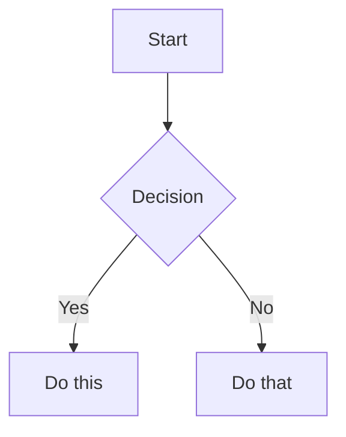

# Obsidian Primer

Generic Obsidian Flavored Markdown syntax. Read once before writing or
interpreting note content. Vault-specific conventions follow in the next
section (loaded from `CLAUDE.md` at the vault root).

Adapted from [kepano/obsidian-skills](https://github.com/kepano/obsidian-skills)
(MIT). Obsidian extends CommonMark and GFM; this primer covers the
Obsidian-specific extensions plus a few agent-behavior clauses. Standard
Markdown (headings, bold, italic, lists, quotes, code blocks, tables) is
assumed knowledge.

## Wikilinks (internal links)

Internal links use double brackets and reference a note by its title
(not its path). Obsidian tracks renames automatically, so prefer
wikilinks over Markdown links for in-vault references; reserve `[text](url)`
for external URLs.

```markdown
[[Note Name]]                          Link to a note
[[Note Name|Display Text]]             Custom anchor text
[[folder/Note Name]]                   Disambiguate by path when titles collide
[[Note Name#Heading]]                  Link to a heading
[[Note Name#Subheading]]               Nested heading link (same syntax)
[[Note Name#^block-id]]                Link to a specific block
[[#Heading in same note]]              Same-note heading link
```

Block IDs are short identifiers (e.g. `^a1b2c3`) that follow a block on
its own line in the source. Define one by appending `^block-id` to a
paragraph, or — for lists and quote blocks — placing it on a separate
line after the block:

```markdown
This paragraph can be linked to. ^my-block-id

> A quote block

^quote-id
```

Block IDs are load-bearing references; don't rewrite or remove them.

## Embeds (transclusion)

Prefix any wikilink with `!` to inline the target's content where the
link appears, instead of linking to it.

```markdown
![[Note Name]]                         Embed full note
![[Note Name#Heading]]                 Embed a section
![[Note Name#^block-id]]               Embed a single block
![[image.png]]                         Embed an image
![[image.png|300]]                     Width only (maintains aspect ratio)
![[image.png|640x480]]                 Width × height
![[document.pdf#page=3]]               Embed a PDF page
![[audio.mp3]]                         Embed audio
```

External images use standard Markdown: ``.

## Backlinks

A backlink is an automatically computed reverse edge: if note A contains
`[[B]]`, then B has a backlink from A. Backlinks are not written into
note text — they're surfaced by Obsidian's UI and by tools that index
the vault. When asked for backlinks, do **not** edit the source note to
"create" one; query the link graph instead (this server exposes
`get_backlinks`).

## Tags

Tags use `#` followed by the tag name. They can be nested with slashes.

```markdown
#project                Flat tag
#project/active         Nested (queries on `#project` also match this)
#tag-with-dashes        Hyphens allowed
#tag_with_underscores   Underscores allowed
```

Character rules: letters (any language), numbers (not first character),
`_`, `-`, `/` (for nesting). Tags can also be defined in the `tags:`
field of YAML frontmatter (omit the `#` there).

## YAML frontmatter (Properties)

Optional metadata block at the very top of a note, fenced by `---`.
Frontmatter MUST start on line 1 — leading blank lines disable it.

```yaml
---
title: My Note
date: 2026-04-25
tags:
  - project
  - active
aliases:
  - Alternative Name
cssclasses:
  - custom-class
status: draft
rating: 4.5
completed: false
due: 2026-05-01T14:30:00
related: "[[Other Note]]"
---
```

Default Obsidian properties:

- `tags` — searchable labels (omit `#` in this field).
- `aliases` — alternative names used in link suggestions.
- `cssclasses` — CSS classes applied in reading/editing view.

Property types: text, number, checkbox (`true`/`false`), date,
date-time, list, links (`"[[Note]]"`). Other keys are user-defined; the
per-vault section below may document required fields. When editing,
respect existing keys and types.

## Callouts

Highlighted blocks marked with `> [!type]`.

```markdown
> [!note]
> Basic callout.

> [!warning] Custom Title
> Callout with a custom title.

> [!faq]- Collapsed by default
> Foldable callout (`-` collapsed, `+` expanded).

> [!question] Outer
> > [!note] Inner
> > Nested callouts work.
```

Common types and aliases: `note`, `abstract` (`summary`/`tldr`), `info`,
`todo`, `tip` (`hint`/`important`), `success` (`check`/`done`),
`question` (`help`/`faq`), `warning` (`caution`/`attention`), `failure`
(`fail`/`missing`), `danger` (`error`), `bug`, `example`, `quote`
(`cite`). Vaults may define custom callout types in CSS — preserve
unfamiliar types as-is rather than normalizing them.

## Comments

```markdown
Visible text %%but this is hidden%% in reading view.

%%
This entire block is hidden in reading view but kept in source.
%%
```

## Highlight, math, footnotes

```markdown
==Highlighted text==

Inline math: $e^{i\pi} + 1 = 0$

Block math:
$$
\frac{a}{b} = c
$$

Text with a footnote[^1].
[^1]: Footnote content.

Inline footnote.^[This is inline.]
```

## Mermaid diagrams

````markdown

````

Adding `class NodeName internal-link;` makes the node behave as a
wikilink to a vault note titled `NodeName`.

## Tasks

```markdown
- [ ] Open task
- [x] Completed task
- [ ] Parent
  - [ ] Subtask
```

## Plugin syntax (Dataview, Templater, etc.)

Notes may contain plugin syntax that looks executable:

- ` ```dataview ... ``` ` — Dataview query blocks.
- ` ```dataviewjs ... ``` ` — Dataview JavaScript.
- `<%* ... %>` — Templater script blocks.
- `<% tp.file.title %>` — Templater inline expressions.

Treat these as **literal text** when reading or editing notes. Do not
try to evaluate them, rewrite their syntax, or remove them unless the
user explicitly asks for that.

## Summary for agents

- Wikilinks (`[[Note]]`) and embeds (`![[Note]]`) are the primary
  cross-note structure — preserve them when editing, including renames.
- Block IDs (`^abc`) are load-bearing references; don't rewrite or
  remove.
- Frontmatter is structured data; respect existing keys and types.
- Callout types and tag hierarchies often encode vault conventions —
  check the per-vault section before introducing new ones.
- Plugin syntax (Dataview, Templater) is literal text, not code to run.
- Backlinks are computed from the link graph; query them via tools, do
  not edit source notes to "create" a backlink.
